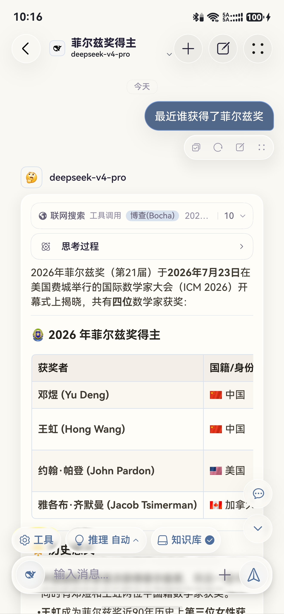
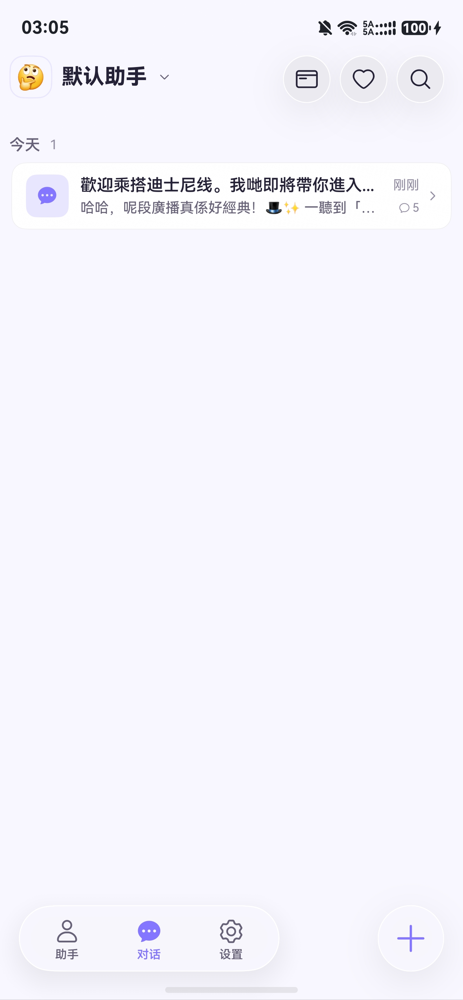
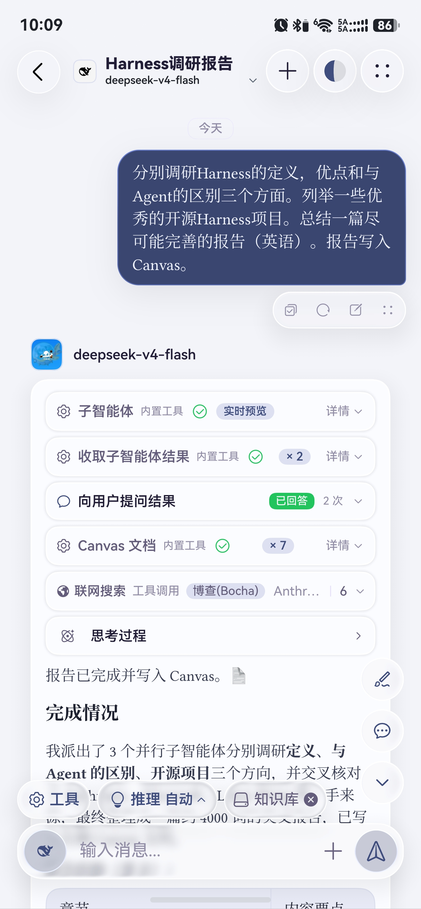
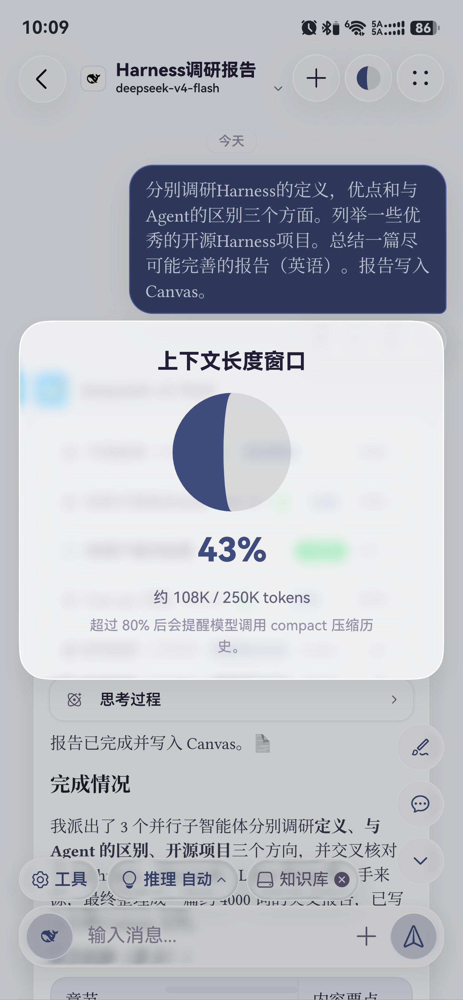
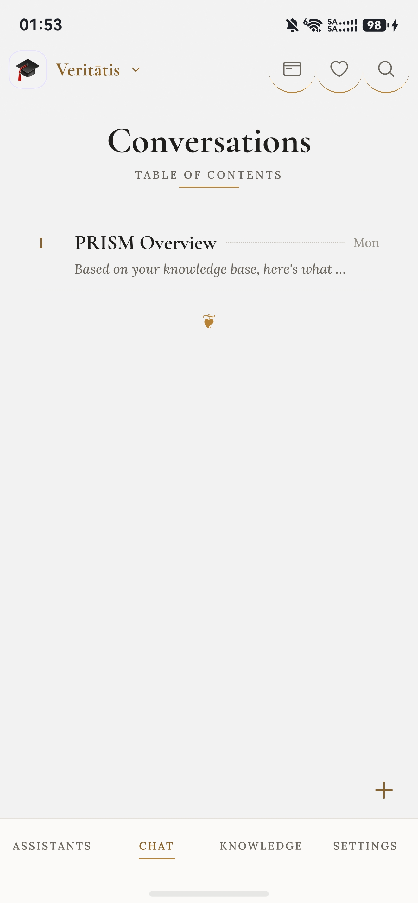

<p align="center">
  
</p>

<h1 align="center">XCube</h1>

<p align="center">
  一款基于 HarmonyOS 7 原生 AI 聊天客户端。
</p>

<p align="center">
  
  <a href="./CHANGELOG.md"></a>
  <a href="./LICENSE"></a>
</p>

<p align="center">
  <a href="./README.md">English</a> · <a href="#功能特性">功能特性</a> · <a href="#快速开始">快速开始</a> · <a href="./CHANGELOG.md">更新日志</a>
</p>

> [!IMPORTANT]
> XCube 要求设备运行 **HarmonyOS 7（API 26.0.0）或更高版本**。如仍在使用 HarmonyOS 6 或更早版本，请先报名[华为 Beta 版测试计划](https://cn.club.vmall.com/mhw/assets/file-html-app/3b2bca9630d0fcb2bb2dfac09ee415ea20230529103243/index.html?ts=1785306752202#/)再安装本应用。

## 界面截图

<table>
  <tr>
    <td align="center"><br/><sub>会话列表</sub></td>
    <td align="center"><br/><sub>知识库</sub></td>
    <td align="center"><br/><sub>子智能体协同</sub></td>
  </tr>
  <tr>
    <td align="center"><br/><sub>上下文</sub></td>
    <td align="center"><br/><sub>手稿模式对话</sub></td>
    <td align="center"><br/><sub>手稿模式会话列表</sub></td>
  </tr>
</table>

## 核心亮点

- 🤖 **兼容任意模型** —— 内置 15+ 服务商，并支持任意 OpenAI、Anthropic 或 Gemini 兼容 API
- 🔍 **联网搜索与 MCP** —— 支持博查、Bing（本地）、Tavily、Exa 和远程 Streamable MCP Server
- 🧩 **可对话子智能体** —— 最多将大型任务拆分给 3 个子智能体，并由主智能体持续多轮引导后统一汇总
- 📚 **本地知识库** —— 结合关键词与向量的混合 RAG，内置 DOCX／XLSX 解析与 OCR；文件始终保留在应用沙箱内
- 🛠️ **内置工具** —— Canvas 文档、Python 沙箱、图表、日历、Map Kit 地图与常用地点，以及 PDF／图片／DOCX／XLSX 转文本
- 🔊 **回复播报** —— 支持 HarmonyOS 离线 TTS 或 ElevenLabs
- 🔒 **隐私优先** —— 所有工具均配有明确的权限控制与用户确认流程

应用完全使用 ArkTS 构建，提供原生 HarmonyOS 交互与沉浸光感材质体验。

> [!NOTE]
> XCube 延续自 [YANGZX22/chatcube](https://github.com/YANGZX22/chatcube)，该项目最初由 [LongLiveY96/ChatCube](https://github.com/LongLiveY96/ChatCube) 分支而来。两个早期版本的版权与 MIT 许可证声明均完整保留。

## 功能特性

### 🤖 兼容任意模型

开箱即用地支持 15+ 服务商：

OpenAI · Claude · Gemini · DeepSeek · Grok · Ollama · OpenRouter · SiliconFlow · Qwen · Kimi · Zhipu（GLM）· Doubao · MiniMax · AiHubMix · MiMo

你还可以自行添加任意 OpenAI、Anthropic 或 Gemini 兼容端点。

### 🧩 并行子智能体

在对话输入区的工具选择器中开启**子智能体**后，主模型可以将多主题调研、来源比较、独立文档处理等任务拆分给最多三个子智能体并行执行，再综合各自的报告。每个返回的 `agentId` 在本次主回复期间持续有效，主模型可以向同一子智能体追问、纠正方向、要求复核或继续深化，并按需要重复任意多轮。

- 每个子智能体在后续轮次中持续保留独立的对话上下文、工具历史与搜索预算
- 可在“子智能体实时预览”面板中查看实时输出、工具调用和运行状态
- 需要使用完整支持工具调用的模型

### 📚 知识库与 RAG

在“知识库”标签页上传 DOCX、XLSX、PDF、Markdown、文本或图片。DOCX 与 XLSX 使用应用内置的 OOXML 解析器处理，图片和扫描版 PDF 可使用本地 OCR。模型会按需通过 [`knowledge_search`](entry/src/main/ets/config/KnowledgeSearchTool.ets) 工具检索资料；应用不会预先检索，也不会将知识片段注入系统提示词。

- **混合检索** —— 融合关键词与向量检索，并扩展相邻片段，避免跨分块的答案被截断
- **DOCX 结构解析** —— 保留标题、段落、列表、换行和表格，并转换为适合语义分块的结构化文本
- **XLSX 表格解析** —— 支持多工作表、共享字符串、日期、合并单元格、公式缓存值和稀疏单元格坐标
- **结构感知分块** —— 保留页边界、标题、列表、表格、工作表与 FAQ 问答对等文档结构
- **两种向量方案** —— PC／2-in-1 设备可使用本地 ArkData Embedding，也可接入任意 OpenAI 兼容的 Embedding API
- **全部保存在本地** —— 文件、OCR 结果、索引和向量均存放在应用沙箱内

> [!NOTE]
> 本地 ArkData Embedding 目前仅支持 2-in-1 设备。手机和平板可使用 API Embedding；即使未配置任何 API，关键词检索仍可正常使用。

> [!NOTE]
> Office 解析目前支持 OOXML 格式 `.docx` 和 `.xlsx`，不支持旧版 `.doc`／`.xls`、加密文件、宏、图表内容或文档内图片 OCR。公式优先读取文件保存的缓存结果，无缓存时保留公式表达式。

### 🛠️ 内置工具

| 工具 | 功能 |
|------|------|
| **联网搜索** | 在搜索预算内获取实时信息；超出预算时会征求你的同意 |
| **Canvas 文档** | 在对话旁维护一份你和 AI 都能编辑的共享文档，并支持 Markdown 预览 |
| **Python 沙箱** | 运行 Python 进行计算、数据处理和中间推导 |
| **数学图表** | 生成基于 [VChart](https://ohpm.openharmony.cn/#/cn/detail/@visactor%2Fharmony-vchart) 的折线图、柱状图、饼图、散点图、桑基图、词云图等可视化 |
| **PDF 转文本** (`pdf_to_text`) | 提取 PDF 文本层；扫描件自动回退到本地 CoreVisionKit OCR |
| **图片转文本** (`image_to_text`) | 使用本地 CoreVisionKit OCR 识别图片文字 |
| **ModLens 视觉理解***(`vision_read_image`) | 通过 [ModLens](https://github.com/liustack/modlens) 为无视觉模型提供图片 OCR、布局、语义与视觉线索，需要单独部署 |
| **DOCX 转文本** (`docx_to_text`) | 在本地提取 DOCX 的标题、段落、列表和表格，不把原始文件交给不支持文档输入的模型 |
| **XLSX 转文本** (`xlsx_to_text`) | 在本地提取 XLSX 的工作表、单元格、日期及公式结果，不把原始文件交给不支持文档输入的模型 |
| **日历** | 在隐私控制下读取用户确认的日期范围，或创建新的日程事件 |
| **地图** | 使用 HarmonyOS Map Kit 搜索地点，并在聊天中展示当前位置、目的地、路线折线、精确位置与地图跟随 |
| **常用地点** (`saved_places`) | 在 **设置 → 工具 → 常用地点** 中通过地点搜索、地图选点或当前精确位置保存任意数量的标签（如“家”“公司”），供模型按标签读取和使用 |
| **花瓣导航** | 将搜索地点、坐标或已保存的常用地点标签交给花瓣地图进行路线导航 |
| **向用户提问** | 模型遇到关键歧义时，可显示确认卡片向用户提问 |

常用地点及其坐标保存在应用本地，只有启用对应工具后模型才能读取；获取当前精确位置和使用 Map Kit 时需要授予应用位置与地图权限。

#### * 为文本模型启用 ModLens 视觉理解

HarmonyOS 应用不能直接运行 ModLens 所需的 Node.js CLI，因此项目提供了一个可选的轻量伴随网关，可自行部署到电脑或服务器。按 [`tools/modlens-gateway/README.md`](tools/modlens-gateway/README.md) 在电脑或服务器启动网关，再进入 **设置 → 工具中心 → ModLens 视觉理解** 填写地址、测试连接并启用工具。

- 只有显式配置并启用工具后，图片才会发送到网关及 ModLens 中配置的视觉 provider
- 当前模型已有原生视觉能力时，应用会自动隐藏该回退工具
- 网关不可用、未启用或模型不支持工具调用时，可选用 `image_to_text`

### 🔊 回复播报

可直接从消息工具栏播报任意回复（**设置 → 播报**）：

- **本地 TTS** —— 使用 HarmonyOS 离线语音引擎；无需 API Key，任何内容都不会离开设备
- **ElevenLabs** —— 使用自己的 API Key，从账号语音中选择音色，并调整稳定性、相似度和语速

## 快速开始

### 环境要求

- 运行 HarmonyOS 7（API 26.0.0）的设备
- [DevEco Studio ≥ 26.0.0 Beta2](https://developer.huawei.com/consumer/cn/deveco-studio/)

### 1. 克隆并配置项目

```bash
git clone https://github.com/YANGZX22/XCube.git
cd XCube
cp build-profile.json5.example build-profile.json5
# 编辑 build-profile.json5，填入你的签名配置
```

### 2. 添加语音识别模型（仅需一次）

ASR 模型体积过大，未纳入 Git 仓库，需要手动添加：

1. 下载 [sherpa-onnx SenseVoice](https://github.com/k2-fsa/sherpa-onnx/releases/download/asr-models/sherpa-onnx-sense-voice-zh-en-ja-ko-yue-2024-07-17.tar.bz2)（支持中文、英语、日语、韩语和粤语）
2. 解压文件，将 `sherpa-onnx-sense-voice-zh-en-ja-ko-yue-2024-07-17` 目录移动到 `entry/src/main/resources/rawfile/`

该模型目录已被 `.gitignore` 排除，不会提交到仓库。

### 3. 运行

使用 DevEco Studio 打开项目，然后在设备上运行。

### 侧载 HAP

可通过 [Auto-installer](https://github.com/likuai2010/auto-installer/) 或 [DevEco Testing](https://developer.huawei.com/consumer/cn/deveco-testing/) 直接在设备上安装。

> [!IMPORTANT]
> 华为签名服务器会屏蔽中国大陆以外的 IP 地址；在其他地区侧载 HarmonyOS NEXT 软件时请留意这一限制。

> [!NOTE]
> 自签名侧载应用默认有效期为 14 天。完成[开发者实名认证](https://developer.huawei.com/consumer/cn/verified/enrollment)后可延长至 180 天。

## 许可证

[MIT](./LICENSE) —— 完整保留 LongLiveY96 原始 ChatCube 与 YANGZX22 后续版本的版权声明；XCube 的修改同样以 MIT 许可证发布。
