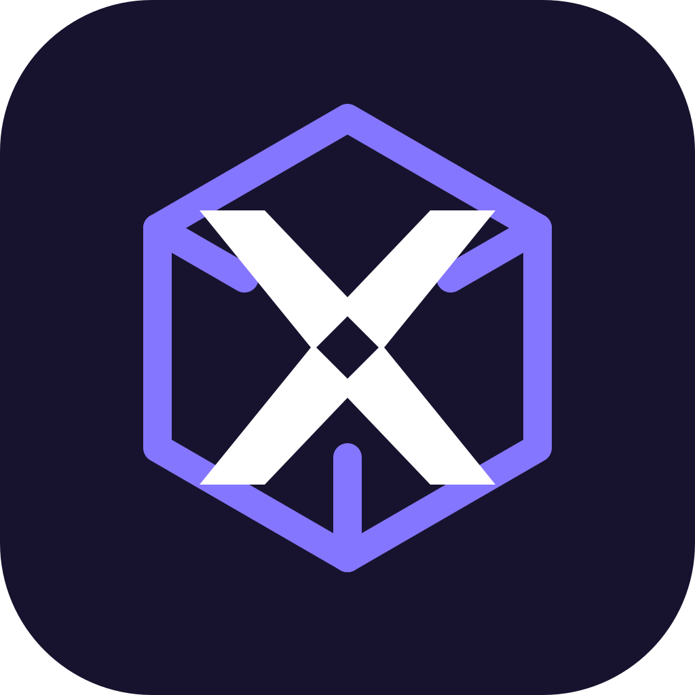
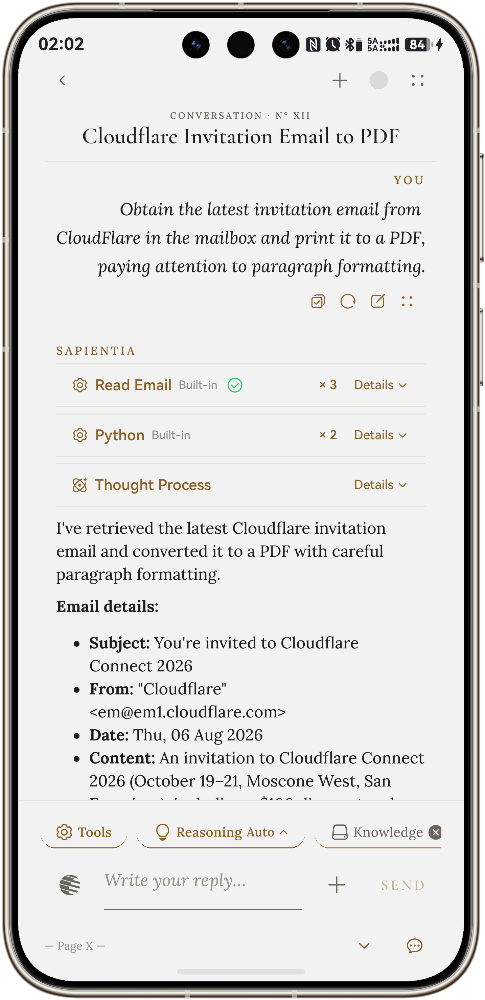
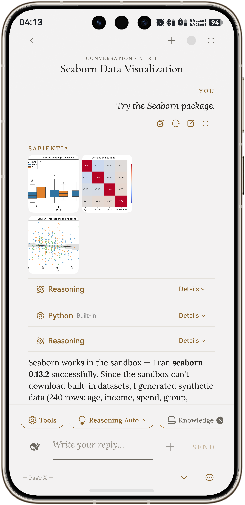
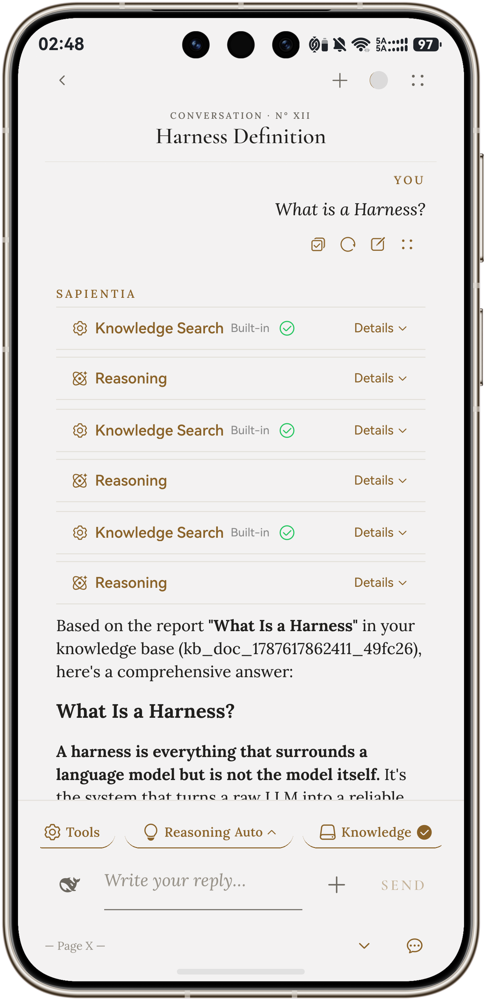
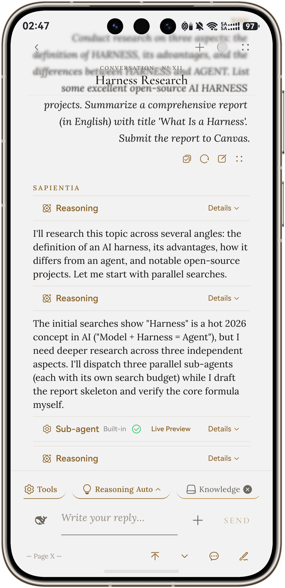
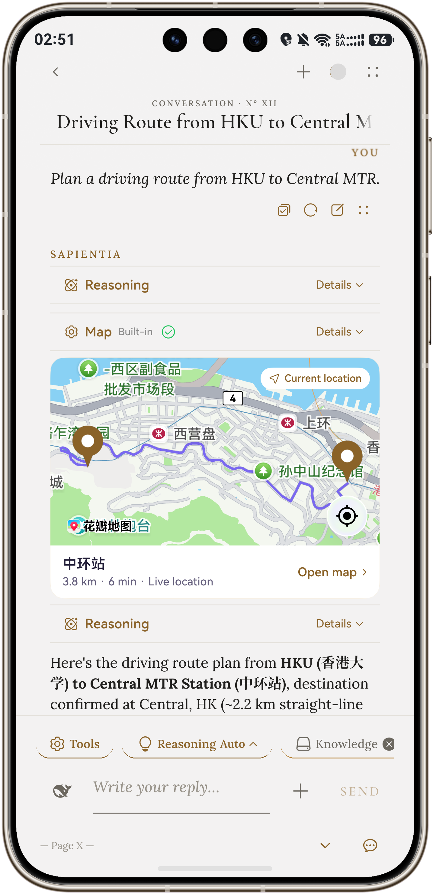
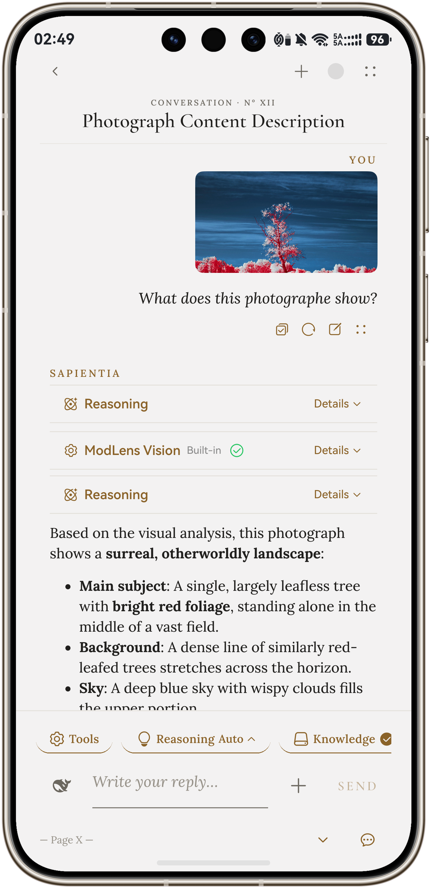

<p align="center">
  
</p>

<h1 align="center">XCube</h1>

<p align="center">
  一款基于 HarmonyOS 7 原生 AI 聊天客户端。
</p>

<p align="center">
  
  <a href="./CHANGELOG.md"></a>
  <a href="./LICENSE"></a>
</p>

<p align="center">
  <a href="./README.md">English</a> · <a href="#功能特性">功能特性</a> · <a href="#快速开始">快速开始</a> · <a href="./CHANGELOG.md">更新日志</a>
</p>

## 基本信息

> [!NOTE]
> 由于临近 HarmonyOS 7 正式发布，本仓库将暂缓更新。待正式版发布后，本应用可能会尝试华为应用市场邀请测试功能，届时安装将更便捷。但请注意，本应用可能永远不会正式上架华为应用市场。


> [!IMPORTANT]
> XCube 要求设备运行 **HarmonyOS 7（API 26.0.0）或更高版本**。HarmonyOS 6 及更早版本的用户需先加入[花粉 Beta 版测试计划](https://cn.club.vmall.com/mhw/assets/file-html-app/3b2bca9630d0fcb2bb2dfac09ee415ea20230529103243/index.html?ts=1785306752202#/)，再安装本应用。测试计划时间以网站为准。

> [!NOTE]
> XCube 延续自 [YANGZX22/chatcube](https://github.com/YANGZX22/chatcube)，该项目最初由 [LongLiveY96/ChatCube](https://github.com/LongLiveY96/ChatCube) 分支而来。两个早期版本的版权与 MIT 许可证声明均完整保留。

## 界面截图

<table>
  <tr>
    <td align="center"><br/><sub>多工具组合工作</sub></td>
    <td align="center"><br/><sub>使用各种 Python 包</sub></td>
    <td align="center"><br/><sub>RAG 智能问答</sub></td>
  </tr>
  <tr>
    <td align="center"><br/><sub>和子智能体协调工作</sub></td>
    <td align="center"><br/><sub>集成地图与导航</sub></td>
    <td align="center"><br/><sub>更好视觉支持</sub></td>
</table>

## 项目概览

- 🤖 **多模型兼容** —— 内置 15 个以上的服务商，并支持 OpenAI、Anthropic 和 Gemini 兼容 API
- 🔍 **联网搜索与 MCP** —— 支持博查、Bing（本地）、Tavily、Exa 和远程 Streamable MCP Server
- 🧩 **多轮子智能体协作** —— 主智能体可将复杂任务分配给最多 3 个子智能体，并在多轮交互后统一汇总结果
- 📚 **本地知识库** —— 结合关键词与向量的混合 RAG，内置 DOCX／XLSX 解析与 OCR；文件始终保留在应用沙箱内
- 🛠️ **内置工具** —— Canvas 文档、计划模式、Python 沙箱、图表、日历、地图与常用地点，以及 PDF／图片／DOCX／XLSX 转文本功能
- 🔊 **回复播报** —— 支持 HarmonyOS 离线 TTS 或 ElevenLabs
- 🔒 **隐私保护** —— 所有工具均设置明确的权限控制与用户确认流程

项目完全使用 ArkTS 构建，致力于打磨 HarmonyOS 原生交互与沉浸光感材质。

## 功能特性

### 🤖 模型与服务商兼容性

内置对以下 15 个以上服务商的支持：

OpenAI · Claude · Gemini · DeepSeek · Grok · Ollama · OpenRouter · SiliconFlow · Qwen · Kimi · Zhipu（GLM）· Doubao · MiniMax · AiHubMix · MiMo

此外，用户可以添加符合 OpenAI、Anthropic 或 Gemini 接口规范的自定义端点。

### 🧩 并行子智能体

在对话输入区的工具选择器中启用**子智能体**后，主模型可以将多主题调研、来源比较和独立文档处理等任务分配给最多三个子智能体并行执行，再汇总各自的结果。每个返回的 `agentId` 在当前主回复期间持续有效，主模型可继续向同一子智能体提问、调整任务方向、要求复核或深化分析，并根据需要进行多轮交互。

- 每个子智能体在后续轮次中持续保留独立的对话上下文、工具历史与搜索预算
- “子智能体实时预览”面板可展示实时输出、工具调用和运行状态
- 此功能需要模型完整支持工具调用

### 📚 知识库与 RAG

“知识库”标签页支持上传 DOCX、XLSX、PDF、Markdown、文本和图片。DOCX 与 XLSX 由应用内置的 OOXML 解析器处理，图片和扫描版 PDF 可使用本地 OCR。模型按需通过 [`knowledge_search`](entry/src/main/ets/config/KnowledgeSearchTool.ets) 工具检索资料；应用不会预先执行检索，也不会将知识片段注入系统提示词。

- **混合检索** —— 融合关键词与向量检索，并扩展相邻片段，以保留跨分块内容的完整性
- **DOCX 结构解析** —— 保留标题、段落、列表、换行和表格，并转换为适合语义分块的结构化文本
- **XLSX 表格解析** —— 支持多工作表、共享字符串、日期、合并单元格、公式缓存值和稀疏单元格坐标
- **结构感知分块** —— 保留页边界、标题、列表、表格、工作表与 FAQ 问答对等文档结构
- **两种向量方案** —— PC／2-in-1 设备可使用本地 ArkData Embedding，也可接入任意 OpenAI 兼容的 Embedding API
- **本地数据存储** —— 文件、OCR 结果、索引和向量均存放在应用沙箱内
- **邮件一键导入** —— 知识库内设与 PDF、Word、表格、图片并列的“邮件”栏；选中 IMAP 邮件后，正文、受支持的附件和内嵌图片会进入同一套解析／OCR 流程。

> [!NOTE]
> 本地 ArkData Embedding 目前仅支持 2-in-1 设备。手机和平板可以使用 API Embedding；未配置 Embedding API 时，关键词检索仍可正常使用。

> [!NOTE]
> Office 解析目前支持 OOXML 格式 `.docx` 和 `.xlsx`，不支持旧版 `.doc`／`.xls`、加密文件、宏、图表内容或文档内图片 OCR。公式优先读取文件保存的缓存结果，无缓存时保留公式表达式。

### 🛠️ 内置工具

| 工具                           | 功能                                                                                                            |
|------------------------------|---------------------------------------------------------------------------------------------------------------|
| **上下文压缩**                    | 将较早对话压缩为摘要以节省上下文                                                                                              |
| **联网搜索**                     | 在搜索预算内获取实时信息；超出预算时请求用户确认                                                                                      |
| **向用户提问**                    | 模型遇到关键歧义时，可通过确认卡片请求用户补充信息                                                                                     |
| **子智能体**                     | 派出并行子智能体处理独立子任务                                                                                               |
| **Python**                   | 运行 Python 进行计算、数据处理和中间推导                                                                                      |
| **PDF 转文本**                  | 提取 PDF 文本层；扫描件自动回退到本地 Core Vision Kit OCR                                                                     |
| **图片转文本**                    | 使用本地 Core Vision Kit OCR 识别图片文字                                                                               |
| **ModLens 视觉理解**<sup>*</sup> | 通过 [ModLens](https://github.com/liustack/modlens) 为无视觉模型提供图片 OCR、布局、语义与视觉线索，需要单独部署                            |
| **DOCX 转文本**                 | 在本地提取 DOCX 的标题、段落、列表和表格，不把原始文件交给不支持文档输入的模型                                                                    |
| **XLSX 转文本**                 | 在本地提取 XLSX 的工作表、单元格、日期及公式结果，不把原始文件交给不支持文档输入的模型                                                                |
| **Skill**                    | 读取用户已启用的技能说明                                                                                                  |
| **Canvas 文档**                | 在对话区域旁维护用户与 AI 均可编辑的共享文档，并支持 Markdown 预览                                                                      |
| **计划模式**                     | 由模型创建多步骤任务计划，并在各步骤实际完成后更新状态。计划状态仅允许模型修改；用户可通过 `/plan` 打开只读面板查看当前执行项与总体进度。计划按会话保存在本地，并在再次进入会话时自动恢复             |
| **数学绘图**                     | 生成基于 [VChart](https://ohpm.openharmony.cn/#/cn/detail/@visactor%2Fharmony-vchart) 的折线图、柱状图、饼图、散点图、桑基图、词云图等可视化 |
| **读取日程**                     | 经用户确认后读取系统日历事件                                                                                                |
| **写入日程**                     | 经用户确认后写入系统日历事件                                                                                                |
| **读取邮件**                     | 通过 IMAP 搜索并读取已授权邮箱，并向模型返回受支持附件的本地文本提取或 OCR 结果。AI 发起的每次读取都需用户明确批准；邮箱凭据保存在系统安全资产存储中，且不会提供给模型                                               |
| **发送邮件**                     | 通过 SMTP 向指定邮箱发送邮件。AI 发起的每次发送都需用户明确确认收件人、主题与正文；邮箱凭据不会提供给模型                                                     |
| **常用地点**<sup>#</sup>         | 在 **设置 → 工具 → 常用地点** 中通过地点搜索、地图选点或当前精确位置保存任意数量的标签（如“家”“公司”），供模型按标签读取和使用                                       |
| **地图**                       | 使用 HarmonyOS Map Kit 搜索地点，并在聊天中展示当前位置、目的地、路线折线、精确位置与地图跟随                                                      |
| **花瓣导航**                     | 将搜索地点、坐标或已保存的常用地点标签交给花瓣地图进行路线导航                                                                               |

> [!IMPORTANT]
> 使用地图相关功能前，必须在 DevEco Studio 中打开 **File → Project Structure → Signing Configs → Enable open capabilities**，启用 **Map Kit** 并应用配置。如果调试 Profile 早于该能力生成，还需重新申请或下载 Profile 并更新签名配置。未启用 Map Kit 通常会返回错误码 `1002600004`。完整步骤参见[Map Kit 集成说明](docs/map-kit-integration.md#上线前必须完成的控制台配置)。

#### <sup>*</sup>[可选] 为文本模型启用 ModLens 视觉理解

HarmonyOS 应用无法直接运行 ModLens 所需的 Node.js CLI，因此项目提供可选的轻量伴随网关，供用户部署至计算机或服务器。请按照 [`tools/modlens-gateway/README.md`](tools/modlens-gateway/README.md) 启动网关，再进入 **设置 → 工具中心 → ModLens 视觉理解** 填写地址、测试连接并启用工具。

- 仅在完成显式配置并启用工具后，图片才会发送至网关及 ModLens 中配置的视觉服务商
- 当前模型已有原生视觉能力时，应用会自动隐藏该回退工具
- 网关不可用、未启用或模型不支持工具调用时，可选用 `image_to_text`

#### <sup>#</sup>常用地点及其坐标保存在应用本地，只有启用对应工具后模型才能读取；获取当前精确位置和使用 Map Kit 时需要授予应用位置与地图权限。

### 🔊 回复播报

消息工具栏支持播报模型回复（**设置 → 播报**）：

- **本地 TTS** —— 使用 HarmonyOS 离线语音引擎；无需 API Key，播报内容仅在设备本地处理
- **ElevenLabs** —— 使用用户配置的 API Key，可选择账号中的音色并调整稳定性、相似度和语速

## 快速开始

### 环境要求

- 运行 HarmonyOS 7(API 26.0.0) 及以上版本的设备 (Phone/Tablet/2-in-1)
- [DevEco Studio ≥ 26.0.0 Beta2](https://developer.huawei.com/consumer/cn/deveco-studio/)

### 1. 克隆并配置项目

```bash
git clone https://github.com/YANGZX22/XCube.git
cd XCube
cp build-profile.json5.example build-profile.json5
# 编辑 build-profile.json5，填写签名配置
```

### 2. 添加语音识别模型（一次性配置）

> [!NOTE]
> ASR 模型体积过大，未纳入 Git 仓库，需要手动添加：

1. 下载 [sherpa-onnx SenseVoice](https://github.com/k2-fsa/sherpa-onnx/releases/download/asr-models/sherpa-onnx-sense-voice-zh-en-ja-ko-yue-2024-07-17.tar.bz2)（支持中文、英语、日语、韩语和粤语）
2. 解压文件，将 `sherpa-onnx-sense-voice-zh-en-ja-ko-yue-2024-07-17` 目录移动到 `entry/src/main/resources/rawfile/`

该模型目录已被 `.gitignore` 排除，不会提交到仓库。

### 3. 运行

使用 DevEco Studio 打开项目，并在目标设备上运行。

#### 或者选择直接侧载 HAP

在 [Release](https://github.com/YANGZX22/XCube/releases) 页面下载最新版本 HAP 文件后，可以通过 [Auto-installer](https://github.com/likuai2010/auto-installer/) 或 [DevEco Testing](https://developer.huawei.com/consumer/cn/deveco-testing/) 将 HAP 安装至设备。

> [!IMPORTANT]
> 华为签名服务器会屏蔽中国大陆以外的 IP 地址。在其他地区侧载 HarmonyOS NEXT (HarmonyOS 6 及以上版本) 软件时，应将注意此限制。

> [!NOTE]
> 自签名侧载应用默认有效期为 14 天。完成[开发者实名认证](https://developer.huawei.com/consumer/cn/verified/enrollment)后可延长至 180 天。

## 许可证

[MIT](./LICENSE): 完整保留 LongLiveY96 原始 ChatCube 与 YANGZX22 后续版本的版权声明；XCube 的修改同样以 MIT 许可证发布。
